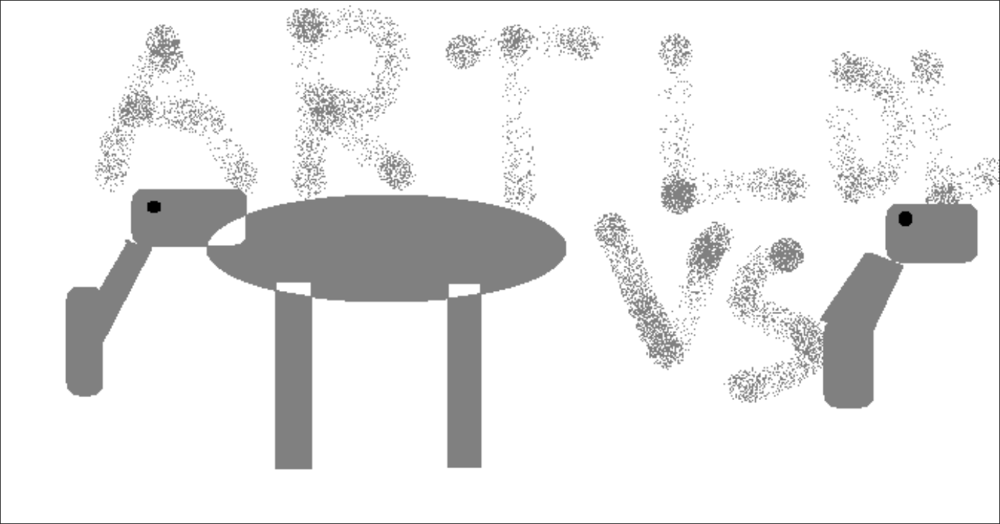

# Reflection-6---Use-Cases-vs.-User-Stories
## #SketchInspo
task: Write a brief description of what you read and how it inspired you. Then, draw a quick sketch of an item related to what you read that meets or doesn't meet the guidelines offered in your reading. Explain your sketch.

brief description: User storys are for understanding small chunks of what the user wants. Use cases provide complete interaction detail and are good for understanding a bigger picture.

This masterpiece shows my view of use case(left) vs user story(right). Use cases are like a whole while user storys are parts of that whole.
